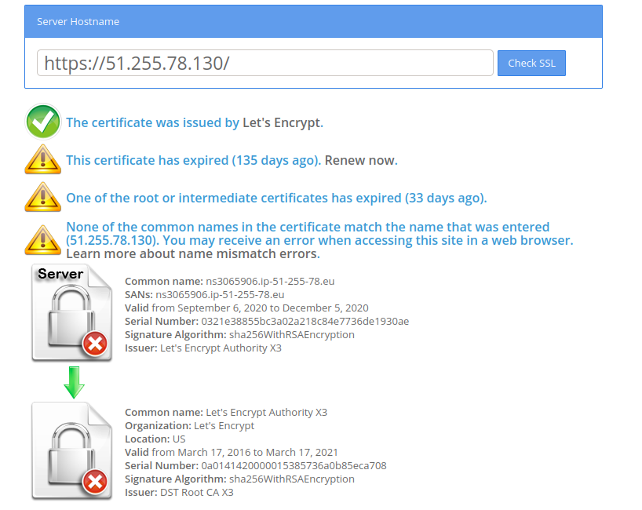

# CAPT-L2 Problèmes

## Sources des problèmes

 

Avant toute chose, nous pensons que l'ancien développeur a fait du très bon travail. Nous pensons que CAPT-L2 est dans cet état pour quatre raisons différentes :

 

- Un développeur, formé sur le tas, pour les technologies web.

Le domaine du web est extrêmement, extrêmement vaste. Je vous invite à regarder ces [roadmaps](https://github.com/kamranahmedse/developer-roadmap). Pour être considéré "full-stack" (donc développeur web complet), il faut savoir faire du front, du back et du dev-ops.

Ceci pourrait aussi expliquer certains choix technologiques.

 

- Un cahier des charges qui a évolué

De ce que nous comprenons, CAPT-L2 était à la base une plateforme pour un projet de recherche qui a évolué vers une plateforme semi-commerciale.

Les besoins entre les deux sont très différents. Les choix technologiques qui ont été faits en amont peuvent ne pas correspondre au cahier des charges actuel (limitation de Django, limitation serveur actuel).

 

- Un manque de temps et de moyens

1 an, pour faire une plateforme web complète, avec un seul développeur, est un délai très réduit.

C'est pour ça que nous nous permettons d'insister sur le fait que l'ancien développeur a fait un excellent travail. Une plateforme web nécessite énormément de travail, une équipe complète avec des spécialités différentes, 1 personne pendant 1 an, c'est un énorme challenge constituer une plateforme web complète.

 

- Un manque de bonnes pratiques et de structure.

Il semble y avoir eu un manque de bonnes pratiques et de cadre pour le code. Effectivement, ça a permis un résultat dans le temps important, mais d'un autre côté le projet est plus difficilement reprenable. Que ce soit des [revues de code](https://fr.wikipedia.org/wiki/Revue_de_code), [Clean code](https://damien.pobel.fr/post/clean-code/), gestionnaire de version.

Ce sont un peu les "mange tes légumes" du développeur. Ils sont rébarbatif, cependant, ils restent extrêmement importants, car ils permettent d'avoir un code plus stable, plus lisible et une [dette technique](https://fr.wikipedia.org/wiki/Dette_technique) bien moindre.

Ce point est aussi à mettre en exergue avec le point 3: tout ceci prend du temps. Mais c'est du temps investi qui ne sera pas perdu après (cf dette technique).

🔴🔴🔴
**Les bonnes pratiques et le clean code sont essentielles dans le cadre de projets. Et sont encore plus primordiaux dans le cadre d'un travail en équipe ou qui est censé être repris par différentes personnes.**
🔴🔴🔴

Voir: [https://www.dialexa.com/our-insights/2019/12/9/five-software-development-best-practices](https://www.dialexa.com/our-insights/2019/12/9/five-software-development-best-practices)

---

---

## Problèmes techniques

---

### **Librairie dépréciée**

 

La librairie **_Libesd_dev_** est déprecié, depuis 2018.

En pratique, cela signifie que nous devons utiliser des version mises sur des repository non-officiel.

🔴 **En conséquence, si ces repos viennent à disparaître (ce qui peut arriver, ce sont des repos communautaires), nous n'aurons plus accès à la librairie et nous seront incapables de reconstruire CAPT-L2.** 🔴

La librairie **_ArcheanAudioLib_** est une librairie propriétaire d'Archean qui est packagé uniquement pour certaines versions de python sur certains processeurs, il est donc nécessaire de la maintenir manuellement à chaque changement de version

---

### **Images docker impossibles à re-construire**

 

Actuellement, nous arrivons juste à reconstruire les images docker sur la machine de l'ancien développeur. C'est fortement liée aux problèmes de librairies ci-dessus.

Concrètement, sur la machine de l'ancien développeur, certaines librairies ont été mises en cache. En conséquence, quand on veut reconstruire une image, docker va aller chercher en local les librairies plutôt que de tenter de les télécharger. (plutôt que sur des repo distants, qui n'existent plus) 🔴 **Nous ne savons toujours pas reconstruire les images docker sur une autre machine. Si cette machine vient à disparaître, en conséquence, nous serons incapables de reconstruire une image CAPT-L2** 🔴.

En pratique, Amélie a avancé sur cette partie. Elle a réussi à reconstruire une image docker, en effectuant pas mal de modification, mais elle n'est pas, à ce jour, utilisable (le conteneur Django ne semble pas communiquer avec le conteneur Nginx, nous ne savons toujours pas pourquoi actuellement.). Nous continuons d'investiguer cette piste.

---

### **Version de python dépassée**

 

Python 3.5 est [officiellement dépréciée](https://www.python.org/downloads/release/python-3510/). Cela signifie plus de support, des paquets en moins et de possibles failles de sécurité à terme.

---

### **Problèmes de SSL / DNS**

Il n'y a actuellement pas de certificat SSL sur le site. Ceci signifie que, lorsque on se connecte sur le site, on voit un avertissement SSL. Il faut forcer l'acceptation du site dans le navigateur.

De plus, il n'y a actuellement pas de DNS pour le site. En conséquence, nous sommes obligés d'utiliser l'adresse ip pour nous connecter au serveur.

---

### **Pratique obsolète**

La méthode de build de l'application est une ancienne méthode dont l'apparition de l'outil docker-compose rend complétement obsolète. L'ancien développeur a créé manuellement des scripts qui sont maintenant automatisés et simplifiés. Il a donc fallu actualiser la méthode de build pour arriver à un résultat plus maintenable.

---

- ## [Retour sommaire](../README.md)
